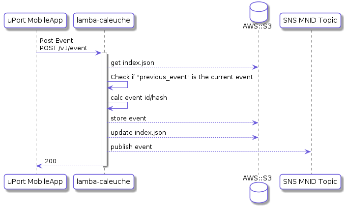

# lambda-caleuche
Caleuche. Event Hub Service

## Description
This lambda functions allow the backup and sync of uPort mobile app events.
"The Caleuche" is a mythical ghost ship of the north Chilote mythology and local folklore of the Chiloé Island, in Chile.


## API Description

### Post Event
The post event endpoint allows the uPort mobile app to send an event.
The lambda function stores the event in an S3 bucket and publish the event in the SNS topic of the MNID of the user.

Future improvements:
* Store encrypted events
* Store on user owned storage (Cognito+s3, Dropbox, etc)
* Use Ethereum Whisper to publish/subscribe

#### Endpoints

`POST /event`

#### Body

```
{
    event_token: <jwt token of the event>
}
```

The `event_token` is a MNID signed jwt of the event wanted to post. The payload of the event_token is:
```
{
    event: <event data>
    previous: <previous event hash>
}
```


#### Response

| Status |     Message    |                                                   |
|:------:|----------------|---------------------------------------------------|
| 200    | Ok.            | Event created and stored                           |
| 401    | Invalid JWT    | Posted token is invalid (signature, expired, etc) |
| 403    | Missing data   | no `event` or no `previous`                           |
| 409    | Bad previous   | `previous` is not the latest id                   |
| 500    | Internal Error | Internal Error                                    |

The response data follows the [`jsend`](https://labs.omniti.com/labs/jsend) standard.

#### Response data
```
{
  status: 'success',
  data: {
    id: <id/hash of the accepted event>
  }
}
```
### Get event(s)
`GET /event/{id}`

#### Headers

```
{
    Authorization: Bearer <jwt>
}
```

#### Body

```
{
    page: <page number to fetch>,
    per_page: <number of events per page>
}
```

Both parameters `page` and `per_page` are optional. Is also optional to specify the event `id` on the querystring (otherwise, it will fetch a paginated subset, or all of the events if `page` and `per_page` are also missing)

#### Response

| Status |     Message    |                                                   |
|:------:|----------------|---------------------------------------------------|
| 200    | Ok.            | A single event or a collection of events                          |
| 401    | Invalid auth    | Bad Authorization header or invalid token |
| 403    | No headers     | Request without `Authorization` header or without headers at all.
| 500    | Internal Error | Internal Error                                    |

The response data follows the [`jsend`](https://labs.omniti.com/labs/jsend) standard.


### Delete a single event
`DELETE /event/{id}`

#### Headers

```
{
    Authorization: Bearer <jwt>
}
```


#### Response

| Status |     Message    |                                                   |
|:------:|----------------|---------------------------------------------------|
| 200    | Ok.            | Events deleted from the identity hub                        |
| 400    | No id     | Request without `id` of the event to delete
| 401    | Invalid auth    | Bad Authorization header or invalid token |
| 403    | No headers     | Request without `Authorization` header or without headers at all.
| 500    | Internal Error | Internal Error                                    |

The response data follows the [`jsend`](https://labs.omniti.com/labs/jsend) standard.

### Delete all
`DELETE /event`

#### Headers

```
{
    Authorization: Bearer <jwt>
}
```


#### Response

| Status |     Message    |                                                   |
|:------:|----------------|---------------------------------------------------|
| 200    | Ok.            | Event(s) deleted from the identity hub                          |
| 401    | Invalid auth    | Bad Authorization header or invalid token |
| 403    | No headers     | Request without `Authorization` header or without headers at all.
| 500    | Internal Error | Internal Error                                    |

The response data follows the [`jsend`](https://labs.omniti.com/labs/jsend) standard.

### Sequence Diagram




